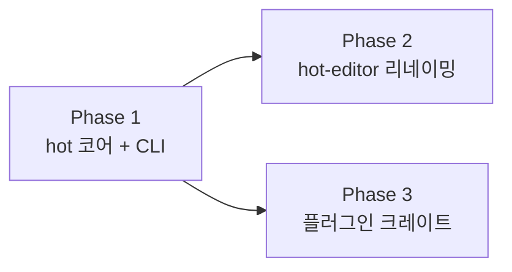

# HOTPAXEL 아키텍처 리팩토링 계획

프로젝트의 원래 의도(hot=client, paxel=server)에 맞게 모노레포 구조를 정비합니다.

## 배경

| 문제 | 상세 |
|---|---|
| [hot](file:///Users/mstorm/src/hotpaxel/crates/hot/src/lib.rs#49-68)의 정체성 부재 | HTML↔TeX 변환 라이브러리일 뿐, 클라이언트 역할을 하지 않음 |
| 변환 엔진이 정규식 30개 | 중첩 태그, 복합 스타일 처리 불가. 확장/유지보수 어려움 |
| CLI가 쉘 스크립트 | macOS/Linux 호환 문제(`grep -P`), `jq` 등 외부 의존성 |
| `tiptex-web` 네이밍 | 내부 구현 기술(Tiptap)을 드러내는 이름, 예제 앱 성격에 안 맞음 |
| xelatex 1회 실행 | 페이지 번호, 목차, 상호참조가 `??`로 표시됨 |

## 목표 구조

```
hotpaxel/
├── crates/
│   ├── hot/                → 코어: IR 정의 + CLI + PAXEL API 클라이언트
│   ├── hot-html/           → 플러그인: HTML ↔ IR (파서 기반, 스타일 지원)
│   ├── hot-markdown/       → 플러그인: Markdown → IR
│   ├── hot-tex/            → 플러그인: IR → TeX
│   └── paxel/              → 렌더링 서버 (Axum, multi-pass 지원 완료)
│
├── apps/
│   └── hot-editor/         → 웹 에디터 예제 앱 (← tiptex-web)
│
└── paxel-cli.sh            → 삭제 (hot CLI로 대체)
```

---

## Phase 1: [hot](file:///Users/mstorm/src/hotpaxel/crates/hot/src/lib.rs#49-68) 코어 + CLI

> [hot](file:///Users/mstorm/src/hotpaxel/crates/hot/src/lib.rs#49-68) crate를 **코어 SDK + CLI 바이너리**로 재구성합니다.
> 기존 정규식 변환 코드는 일단 유지하되, 플러그인 트레이트를 정의합니다.

### 핵심 설계: 플러그인 트레이트

```rust
// hot/src/ir.rs — 중간 표현
pub enum HotNode {
    Text(String),
    Bold(Vec<HotNode>),
    Italic(Vec<HotNode>),
    Heading { level: u8, children: Vec<HotNode> },
    List { ordered: bool, items: Vec<Vec<HotNode>> },
    Image { path: String, options: String },
    Styled { style: HotStyle, children: Vec<HotNode> },
    Raw(String),  // 보호 토큰 ({{ var }} 등)
}

pub struct HotStyle {
    pub font_family: Option<String>,
    pub font_size: Option<f64>,
    pub color: Option<String>,
    pub text_align: Option<Align>,
    pub text_decoration: Option<Decoration>,
}

// hot/src/traits.rs — 플러그인 인터페이스
pub trait Parser {
    fn parse(&self, input: &str) -> Vec<HotNode>;
}

pub trait Renderer {
    fn render(&self, nodes: &[HotNode]) -> String;
}
```

### 파일 변경 목록

#### [MODIFY] [Cargo.toml](file:///Users/mstorm/src/hotpaxel/crates/hot/Cargo.toml)

```toml
[[bin]]
name = "hot"
path = "src/main.rs"

[target.'cfg(not(target_arch = "wasm32"))'.dependencies]
clap = { version = "4", features = ["derive"] }
reqwest = { version = "0.12", features = ["blocking", "json"] }
base64 = "0.22"
```

#### [NEW] `src/ir.rs` — `HotNode`, `HotStyle` 정의
#### [NEW] `src/traits.rs` — `Parser`, `Renderer` 트레이트
#### [NEW] `src/client.rs` — PAXEL API 클라이언트 (`#[cfg(not(wasm))]`)
#### [NEW] [src/main.rs](file:///Users/mstorm/src/hotpaxel/crates/paxel/src/main.rs) — CLI 바이너리 (clap)

```
USAGE: hot <COMMAND>

COMMANDS:
  compile  <input> [output.pdf]   변환 + 컴파일 (서버 필요)
  convert  <input> [-o output]    포맷 변환 (로컬, 서버 불필요)
  fonts                            서버 폰트 목록
  font-download <name>             폰트 다운로드

OPTIONS:
  --host <url>      PAXEL 서버 URL (default: $PAXEL_HOST)
  --from <format>   입력 포맷 (auto/html/markdown, 확장자로 자동 판별)
  --passes <n>      xelatex 실행 횟수 (default: 2)
```

#### [MODIFY] [src/lib.rs](file:///Users/mstorm/src/hotpaxel/crates/hot/src/lib.rs) — 기존 [HotConverter](file:///Users/mstorm/src/hotpaxel/crates/hot/src/lib.rs#40-41) 유지 + `#[cfg]` 게이트 추가
#### [DELETE] [paxel-cli.sh](file:///Users/mstorm/src/hotpaxel/paxel-cli.sh) — CLI 완성 후 삭제

---

## Phase 2: `tiptex-web` → `hot-editor` 리네이밍

> 디렉토리, Docker 이미지, CI/CD 참조를 일괄 변경합니다.

| Before | After |
|---|---|
| `apps/tiptex-web/` | `apps/hot-editor/` |
| `hotpaxel/tiptex-web` (Docker) | `hotpaxel/hot-editor` (Docker) |
| `docker-compose.yml` 서비스명 | `tiptex-web` → `hot-editor` |

### 변경 파일

| 파일 | 변경 |
|---|---|
| `apps/hot-editor/package.json` | `name` 필드 |
| `apps/hot-editor/index.html` | `<title>` |
| `apps/hot-editor/Dockerfile` | 경로 참조 |
| `docker-compose.yml` | 서비스명, 이미지명 |
| `Dockerfile` (루트) | 경로 참조 |
| `build-all.sh`, `build.sh` | 이미지명 |
| `README.md` | 모듈 설명 |
| `.github/workflows/*` | CI/CD 참조 |

---

## Phase 3: 플러그인 크레이트 구현

> 정규식 기반 변환을 파서 기반 플러그인으로 교체합니다.

### [NEW] `crates/hot-html/` — HTML ↔ IR

- HTML 파서 (`tl` 또는 `html5ever`) 사용
- 인라인 스타일 파싱 (`font-family`, `font-size`, `color` 등 → `HotStyle`)
- `impl Parser + impl Renderer for HtmlConverter`

### [NEW] `crates/hot-markdown/` — Markdown → IR

- `pulldown-cmark` 사용 (WASM 호환, pure Rust)
- `impl Parser for MarkdownParser`

### [NEW] `crates/hot-tex/` — IR → TeX

- `HotNode` → TeX 문자열 렌더링
- `HotStyle` → `\fontspec`, `\fontsize`, `\textcolor` 등 매핑
- `impl Renderer for TexRenderer`

### WASM 빌드

브라우저용 WASM에서는 필요한 플러그인만 포함:

```toml
# hot/Cargo.toml (WASM feature)
[features]
wasm = ["hot-html"]  # 브라우저에서는 HTML 변환만 필요
```

---

## Phase 요약 및 실행 순서



| Phase | 요약 | 의존성 |
|---|---|---|
| **1** | `hot` 코어 (IR·트레이트·CLI·클라이언트) | 없음 (가장 먼저) |
| **2** | `tiptex-web` → `hot-editor` 리네이밍 | Phase 1과 독립 |
| **3** | `hot-html`, `hot-markdown`, `hot-tex` 플러그인 | Phase 1 완료 후 |

> [!NOTE]
> Phase 2는 Phase 1과 **독립적으로 병행 진행 가능**합니다.
> Phase 3은 Phase 1에서 정의한 IR과 트레이트에 의존하므로 Phase 1 완료 후 진행합니다.

## Verification Plan

### Phase 1
- `cargo build -p hot` → CLI 바이너리 빌드 확인
- `wasm-pack build crates/hot` → WASM 빌드 정상 확인
- `./target/debug/hot compile test.tex` → PDF 생성 테스트
- `./target/debug/hot fonts` → 폰트 조회 테스트
- `cargo test -p hot` → 기존 단위 테스트 통과

### Phase 2
- `docker-compose up --build` → 전체 빌드 확인
- `http://localhost:8888` → 에디터 UI 동작 확인

### Phase 3
- `cargo test -p hot-html` → HTML 파싱 + 스타일 추출 테스트
- `cargo test -p hot-markdown` → Markdown 파싱 테스트
- `cargo test -p hot-tex` → TeX 렌더링 테스트
- `hot convert test.md -o test.tex` → 종단 테스트
